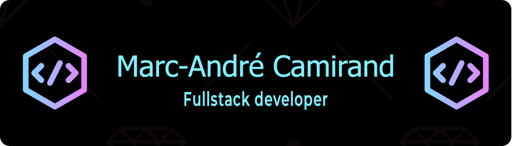

<h1 align="center">Hi 👋, I'm Marc-André Camirand</h1>
<h3 align="center">A FullStack developer from Canada</h3>

- 👨‍💻 I’m currently working on **Personal project in finance industry** and **OPEN to opportunities**

- 🌱 I’m currently learning **JavaScript** => **React** and **GatsbyJS**

- 💬 Ask me about **SEO, business development, startup, finance**

- ⚡ I love **Sailing, traveling, rum and whiskey**

-  Fellow Le Wagon Montreal bootcamp student

<h3 align="left">Languages and Tools:</h3>

 
     
     
     
     
    
     
     
     
    
      
     
     
  
 

